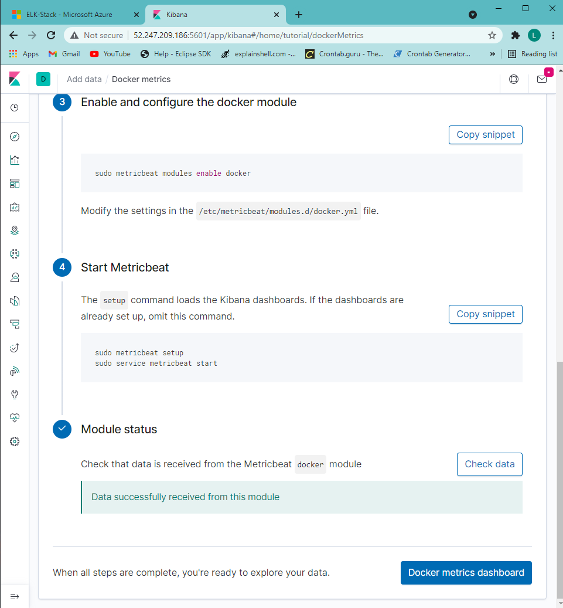

# Cybersecurity-Bootcamp
Project 1 - ELK Stack
## Automated ELK Stack Deployment

The files in this repository were used to configure the network depicted below.

These files have been tested and used to generate a live ELK deployment on Azure. They can be used to either recreate the entire deployment pictured above. Alternatively, select portions of the playbook file may be used to install only certain pieces of it, such as Filebeat.

  - [filebeat-playbook.yml](Ansible/filebeat-playbook.yml)

This document contains the following details:
- Description of the Topology
- Access Policies
- ELK Configuration
  - Beats in Use
  - Machines Being Monitored
- How to Use the Ansible Build

### Description of the Topology

The main purpose of this network is to expose a load-balanced and monitored instance of DVWA, the D*mn Vulnerable Web Application.

Load balancing ensures that the application will be highly available, in addition to restricting access to the network.
- Load balancers protect from denial of service attacks. The advantage of using a jump box is provides enhanced security.

Integrating an ELK server allows users to easily monitor the vulnerable VMs for changes to the log files and system performance.
- log files
- records metric data

The configuration details of each machine may be found below.
_Note: Use the [Markdown Table Generator](http://www.tablesgenerator.com/markdown_tables) to add/remove values from the table_.

| Name      | Function | IP Address  | Operating System |
|-----------|----------|-------------|------------------|
| Jump Box  | Gateway  | 40.83.170.52| Linux            |
| Web-1     |   VM     | 10.0.0.5    | Linux            |
| Web-2     |   VM     | 10.0.0.6    | Linux            |
| ELK-Stack | ELKStack | 10.1.0.4    | Linux            |

### Access Policies

The machines on the internal network are not exposed to the public Internet. 

Only the Jumpbox machine can accept connections from the Internet. Access to this machine is only allowed from the following IP addresses:
- 24.32.44.75

Machines within the network can only be accessed by port 22.
- 40.83.170.52

A summary of the access policies in place can be found in the table below.

| Name     | Publicly Accessible | Allowed IP Addresses |
|----------|---------------------|----------------------|
| Jump Box |    No               |     24.32.44.75      |
| DVWA-VMs |    No               |     40.83.170.52     |
| ELK Stack|    No               |     40.83.170.52     |

### Elk Configuration

Ansible was used to automate configuration of the ELK machine. No configuration was performed manually, which is advantageous because...
- The main advantage of automating configuration with ansible is that it can install on multiple machines at the same time.

The playbook implements the following tasks:
- Increase the memory on ELK VM
- Install docker.io
- Install python3-pip
- Install docker module
- Download and launch a docker elk container

The following screenshot displays the result of running `docker ps` after successfully configuring the ELK instance.

**Note**: The following image link needs to be updated. Replace `docker_ps_output.png` with the name of your screenshot image file.  

### Target Machines & Beats
This ELK server is configured to monitor the following machines:
- 10.0.0.5
- 10.0.0.6

We have installed the following Beats on these machines:
- filebeat-7.6.1-amd64.deb
- metricbeat-7.6.1-amd64.deb

These Beats allow us to collect the following information from each machine:
- Filebeat is used to send log files to kibana. It monitors and collects log events from the specified servers.
- Metricbeat collects the metrics and statistics and sends them to the specified output, such as elasticsearch.

### Using the Playbook
In order to use the playbook, you will need to have an Ansible control node already configured. Assuming you have such a control node provisioned: 

SSH into the control node and follow the steps below:
- Copy the filebeat-config.yml file to filebeat-configuration.yml.
- Update the hosts file to include 10.0.0.5, 10.0.0.6
- Run the playbook, and navigate to kibana to check that the installation worked as expected.

### Answers to Questions
- The file is filebeat-playbook.yml and it isa copied to /etc/filebeat/filebeat.yml
- To make ansible run the playbook on a specific machine you update the hosts file located in /etc/ansible
-  http://[your.VM.IP]:5601/app/kibana
